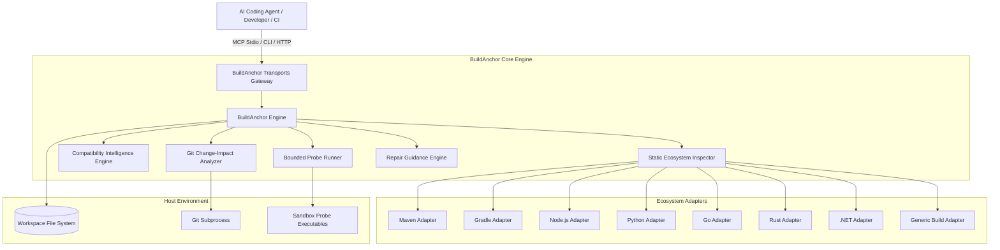
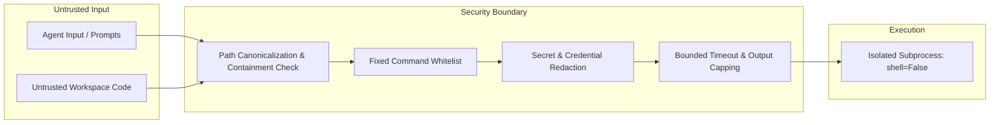
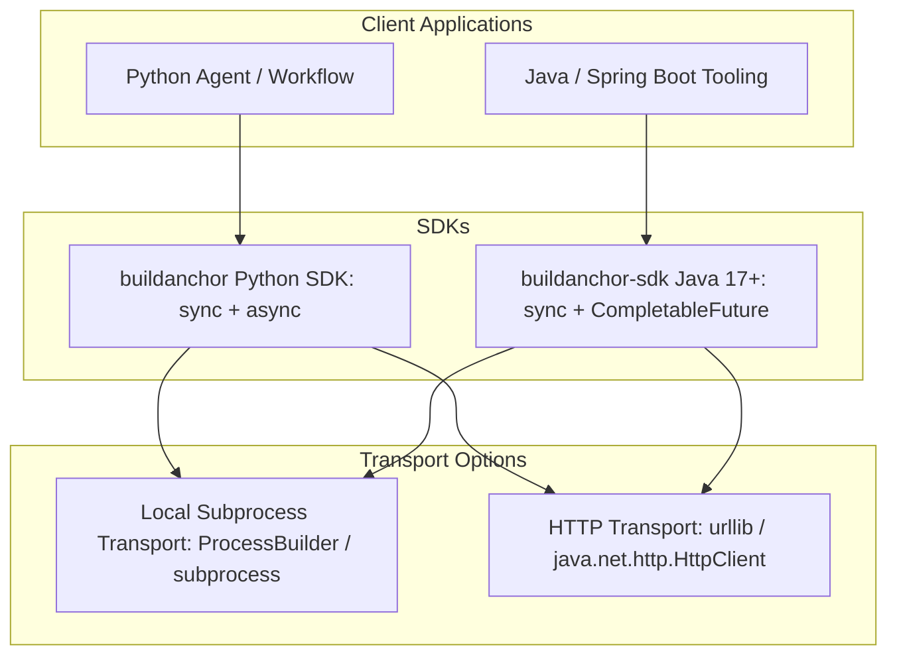

# BuildAnchor Architecture Specification

This document defines the system architecture, component design, execution invariants, security model, and interface contracts for **BuildAnchor** under **Tensilestream**.

---

## 1. Architectural Vision & Scope

BuildAnchor provides an authoritative, local-first **Build Truth and Change Validation Layer** for AI coding agents (Claude Code, Cursor, Windsurf, Aider, Codex, GitHub Copilot Workspace, and CI/CD pipelines).

### Core Problem
AI coding agents generate modifications rapidly. However, agents routinely introduce silent regressions:
- They import mismatched dependency namespaces (e.g., `javax.*` instead of `jakarta.*` in modern Spring Boot).
- They introduce dependencies incompatible with declared runtime targets.
- They break build configurations, compile targets, or project-defined constraints.
- They assume code changes passed without running verified, bounded validation probes.

### The Architectural Invariant
> **BuildAnchor reports only what a repository can prove.**  
> It never converts missing tools or unexecuted checks into passing assertions. It enforces strict evidence-backed verification before and after an external agent acts.

BuildAnchor itself is **not a code-modifying agent**; it is the **truth engine** that inspects constraints, validates changes, and provides actionable repair guidance to external agents and developers.

---

## 2. System Context & Component Architecture

BuildAnchor sits between the AI Agent / Developer and the host Operating System / Build Environment:



### 2.1 Component Responsibilities

1. **Transports Gateway (`transports.py`):**
   - **MCP Stdio Server:** Standard Model Context Protocol (`2025-06-18` schema) for seamless integration with Cursor, Claude Code, and Windsurf.
   - **CLI Interface (`cli.py`):** Shell-native interface supporting text, JSON, Markdown, and SARIF output formats with POSIX exit codes.
   - **HTTP Server (`serve_http`):** Lightweight HTTP REST service exposing versioned `/v1/*` endpoints.

2. **Static Ecosystem Inspector (`engine.py`):**
   - Scans repository markers safely within configured workspace boundaries.
   - Resolves modules, target runtimes, declared dependencies, and validation candidates without running arbitrary project scripts or accessing external networks.
   - Computes deterministic SHA-256 workspace digests while ignoring transient caches and bytecode.

3. **Compatibility Intelligence Engine (`compatibility.py`):**
   - Rule-based detection of ecosystem breaking changes and framework migrations (e.g., Spring Boot 3 Jakarta namespace transitions).
   - Maps symbols and legacy coordinates to evidence-backed modern replacements.
   - Flags incompatible states as blocking gates before agents make source changes.

4. **Git Change-Impact Analyzer (`engine.py`):**
   - Compares current working tree (including tracked and untracked files) against a designated Git baseline commit (e.g., `HEAD` or pull request base SHA).
   - Determines which facts, runtime environments, and build commands are affected by changed files.

5. **Bounded Probe Runner (`engine.py`):**
   - Executes detected validation commands with strict sandboxing: `shell=False`, argument arrays only, per-command timeouts (default 300s, max 900s), and bounded output capture (12 KB truncation).
   - Classifies probe results into four honest states: `passed`, `failed`, `timed_out`, or `unavailable`.

6. **Repair Guidance Engine (`engine.py`):**
   - In case of validation failure or blocking compatibility errors, constructs structured remediation advice with affected files, root causes, and re-validation instructions.

---

## 3. The 5-Stage Agent Lifecycle

BuildAnchor operationalizes agent workflows into a deterministic loop:

```text
Inspect  ──▶  Preflight / Plan  ──▶  Act  ──▶  Validate  ──▶  Repair Guidance
  ▲                                                                 │
  └────────────────────────── Repeat if Invalid ────────────────────┘
```

1. **Stage 1: Inspect (`build.inspect`)**  
   Discover repository build systems, runtime targets, declared dependencies, candidate validation commands, and limitations.
2. **Stage 2: Plan (`build.plan` / `build.preflight`)**  
   Generate an authoritative Build Context Pack bounded by token budget, verify compatibility rules, and establish baseline workspace digests before the agent edits code.
3. **Stage 3: Act (External Agent)**  
   The external agent (Claude, Cursor, developer) applies modifications to code, dependencies, or configuration.
4. **Stage 4: Validate (`build.validate_change`)**  
   Analyze Git diff impact. When `--execute` is opted in, run bounded validation probes. Returns status `valid`, `invalid`, `inconclusive`, or `blocked`.
5. **Stage 5: Repair (`build.repair_guidance`)**  
   If invalid, returns structured diagnostic issues, affected files, and recommended remediation actions.

---

## 4. Security Architecture & Threat Model

BuildAnchor is engineered to run safely in multi-tenant CI runners and automated agent sandboxes.



### 4.1 Threat Mitigations

| Threat | Architectural Defense |
| :--- | :--- |
| **Workspace Escape / Path Traversal** | All paths are resolved and canonicalized against `allow_root`. If a path resolves outside the root, `BuildAnchorError` is raised immediately. |
| **Arbitrary Command Injection** | Raw shell strings from agents or workspace files are strictly rejected. Probes are constructed from fixed internal templates and executed via argument arrays with `shell=False`. |
| **Denial of Service / Hanging Probes** | Every probe has an enforced timeout (default 300s, hard maximum 900s). Subprocesses exceeding the timeout are terminated and recorded as `timed_out`. |
| **Output Flooding / Buffer Exhaustion** | Captured standard output and standard error are truncated to the last 12,000 characters to prevent memory exhaustion and context window overflow. |
| **Credential & Secret Leakage** | Evidence collectors avoid passing credentials to tools, redact authentication tokens from output, and store SHA-256 digests instead of sensitive file bodies. |
| **False Passing Assertions** | If a tool or baseline is missing, the status is reported as `inconclusive`, never converted into a `valid` pass. |

---

## 5. Report Schema & Data Contract

All interfaces (CLI, MCP, HTTP, Python SDK, Java SDK) return responses adhering to the versioned JSON Schema ([`schemas/v1/report.schema.json`](../schemas/v1/report.schema.json)).

### 5.1 Status State Machine

| Status | Definition | Exit Code |
| :--- | :--- | :--- |
| **`valid`** | All static compatibility rules passed, and all executed validation probes succeeded with exit code 0. | `0` |
| **`invalid`** | A static compatibility rule failed (severity: error) or an executed probe failed / timed out. | `1` |
| **`inconclusive`** | No Git repository detected, no changes detected, or an essential probe executable was unavailable on the host. | `2` |
| **`blocked`** | Pre-flight compatibility or policy rules prevent the agent from proceeding safely. | `3` |

### 5.2 Progressive Context Disclosure
To avoid consuming LLM token context unnecessarily:
- **`ContextPack` (`build.context`):** Compact summary (~500–2000 tokens) providing runtime facts, key constraints, and validation commands.
- **`BuildReport` (`build.inspect`):** Complete structured fact inventory with evidence references.
- **Raw Evidence:** Retained on disk and referenced by SHA-256 evidence IDs (`ev_<hash>`).

---

## 6. Multi-Language SDK Architecture

BuildAnchor provides first-class native client SDKs with zero unnecessary runtime dependencies.



### 6.1 Python SDK (`buildanchor`)
- **Compatibility:** Python 3.10+
- **Features:** Synchronous (`BuildAnchorClient`) and asynchronous (`AsyncBuildAnchorClient`) clients.
- **Transports:** Direct in-process engine instantiation, pinned local binary execution, or HTTP client via standard library `urllib`.

### 6.2 Java SDK (`com.buildanchor:buildanchor-sdk`)
- **Compatibility:** Java 17+
- **Features:** Dependency-free client with `CompletableFuture` asynchronous methods and `AutoCloseable` resource management.
- **Transports:** Standard `java.net.http.HttpClient` for remote servers, and fixed `ProcessBuilder` argument arrays for local execution.

---

## 7. Adapter Specification & Extensibility

Every build ecosystem adapter implements a five-phase lifecycle:

```text
detect() ──▶ inspect() ──▶ resolve() ──▶ validate() ──▶ explain()
```

### 7.1 Adapter Coverage Matrix

| Ecosystem | Detected Markers | Primary Facts Extracted | Validation Probe Convention |
| :--- | :--- | :--- | :--- |
| **Maven** | `pom.xml`, `mvnw` | Java compiler source/target, Spring Boot version, declared dependencies, Jakarta persistence namespace. | `./mvnw test` or `mvn test` |
| **Gradle** | `build.gradle`, `build.gradle.kts`, `settings.gradle*`, `gradlew` | Java toolchain compatibility, Spring Boot plugin version, Gradle modules. | `./gradlew test` or `gradle test` |
| **Node.js** | `package.json`, `package-lock.json`, `pnpm-lock.yaml`, `yarn.lock` | Engines (`node`), `packageManager`, dependencies, devDependencies. | `npm test` or `npm run build` |
| **Python** | `pyproject.toml`, `requirements*.txt`, `uv.lock`, `setup.py` | `requires-python`, declared dependency specs. | `python -m unittest` or `pytest` |
| **Go** | `go.mod`, `go.sum` | Go toolchain version, required modules with semantic versions. | `go test ./...` |
| **Rust** | `Cargo.toml`, `Cargo.lock` | Rust edition, dependencies with version constraints. | `cargo test` |
| **.NET** | `*.csproj`, `*.fsproj`, `*.vbproj`, `global.json` | `TargetFramework`, declared package references. | `dotnet test` |
| **Generic** | `Makefile`, `CMakeLists.txt`, `BUILD`, `Package.swift`, `Dockerfile` | Presence of build descriptors and candidate target markers. | Reported as candidate without automatic invocation. |

---

## 8. Repository Structure & Governance

```text
BuildAnchor/
├── .github/                  # GitHub Actions CI, CodeQL, Scorecard, issue templates
├── .pre-commit-hooks.yaml    # Pre-commit framework hooks for git workflows
├── CHANGELOG.md              # Semantic version changelog
├── CODE_OF_CONDUCT.md        # Contributor Covenant standard
├── CONTRIBUTING.md           # Guidelines for code and adapter contributions
├── GOVERNANCE.md             # Project governance & maintainer guidelines
├── LICENSE                   # Apache-2.0 License
├── NOTICE                    # Tensilestream copyright & attribution
├── README.md                 # Developer quickstart, MCP setup, badges
├── SECURITY.md               # Vulnerability disclosure policy
├── SUPPORT.md                # Community discussions & issue reporting
├── pyproject.toml            # Python packaging metadata & entry points
├── uv.lock                   # Pinned dependency lockfile
├── docs/
│   ├── ARCHITECTURE.md       # This specification
│   └── INTEGRATION.md        # Agent integration & CI implementation guide
├── schemas/
│   └── v1/
│       └── report.schema.json # JSON Schema definition for Build Truth reports
├── sdk/
│   ├── java/                 # Dependency-free Java 17 SDK
│   └── python/               # Python SDK documentation
├── src/
│   └── buildanchor/          # Core engine, transports, CLI, and compatibility rules
└── tests/                    # Unit, CLI, SDK, and transport test suites
```
